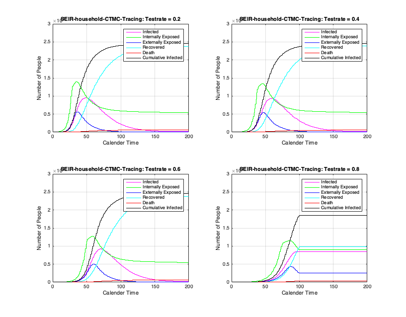
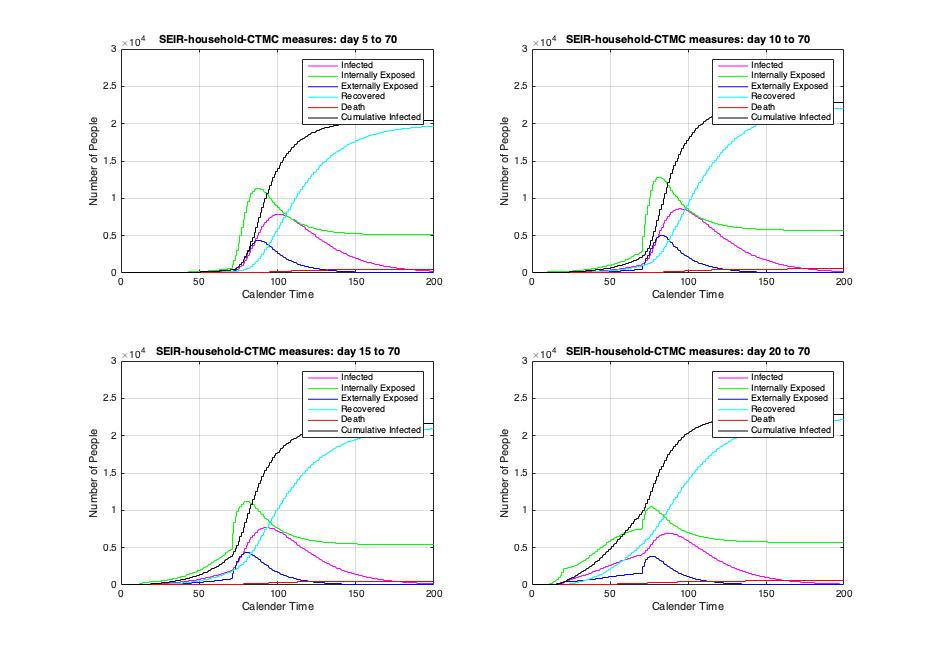
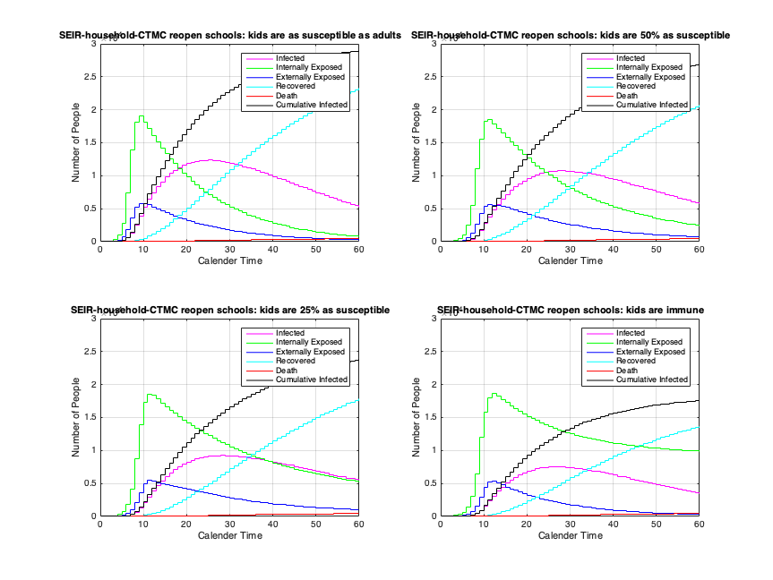

# ORIE 6510 - Probability – COVID-19 simulations
Date: 2020/5/8
Author:
  - Desheng Ma dm852
  - Prof. Andreea Minca acm299

## Introduction/Motivation

As the COVID-19 has impacted everything in daily life, people have also been exploring possbilities to reopen. In this work, we present a simulation study based on Continuous Time Markov Chain (CTMC) to discuss the different scenarios of monitoring and reopening with their corresponding potential results. 

There are primarly three scenarios we consider:

1. Tracing

   - **Test rate**: an infected individual has a probability (= test rate) of getting a test. Once this individual is tested, isolation (and treatment) is immediately enforced. We call this individual “reported infected”.

   - **Radius**: people who were in close contact with the reported infected individual (family members, colleagues, classmates, etc.). People in the radius are also immediately put into isolation once the infected individual is tested.
   - How would tracing enforcement help stop the spread/flatten the curve?

2. Reopening 

   - Assuming we started taking measures on a certain day, when should we reopen?

   - Assuming we must reopen on a certain day, how would the start day of taking measures have affected the curve beforehand? 
     - How precisely should we know the exact day when we started social distancing? 

3. Reopening only schools

   - Assuming kids/teens are relatively less susceptible (or almost immune) and do not likely transmit the virus to others, can we reopen elementary/junior high schools first?

## Model

The SEIR model is too simplistic because it does not account for a household structure (whereas the basis of all lockdown measures rely on isolating households and the internal exposure through the household is critical).

Therefore, here we propose a new SEIR model, where nodes represent households, and edges represent connections between households. More details as follow:

- Connections can stem from various sources, and in general we have a multi-layer network. In our model, we consider a two layer network, school and work.

- Each household is represented by a three dimensional type, ($x_1$ $x_2$ $x_3$):

  - the number of children in school/daycare
  - working adults 
  - elderly family members. 

  These are drawn from a joint distribution, characteristic to the population. Other interpretations in terms of risk groups are possible.

- An entire household is exposed immediatels if any member of the household is exposed. Initially there is one exposed household and all other households are susceptible.

- Individuals by status are divided in the following groups: 

  - Infectious
  - Externally Exposed
  - Internally Exposed
  - Recovered
  - Deceased
  - Susceptible

  ,all of which are multi dimensional corresponding to the multiple types.

- Outside the same household, we assume that the average number of people an infected individual can expose is $k$. Furthermore, from data we draw a probability of transmission $b$. Therefore, Transmissoin rate can be parametrized as $\vec \beta = \vec k*b$

- infectious school children expose other school children with a rate $\beta_1 = k_1*b$ and infectious working adults expose other working adults with a rate $\beta_2 = k_3*b$ per unit time. If the elderly family members always stay at home, $k_3 = 0$, and thus they do not expose anyone. This simple external infection rate structure may be generalized.

- Exposed individuals become infectious with a given rate $\delta$ (think of this as the incubation period of the virus.) For the Covid-19, the incubation period ranges from 2–14 days, the average being 5.1 days. <https://www.ncbi.nlm.nih.gov/pmc/articles/PMC7081172/>

  <https://www.cdc.gov/coronavirus/2019-ncov/hcp/faq.html>

- When externally exposed individuals become infectious, they internally expose all members of their household.

- There are two outcomes for infectious individuals: recovered and deceased, with respective rates $\vec \gamma$ = ($\gamma_1$ $\gamma_2$ $\gamma_3$)  and $\vec \alpha$ = ($\alpha_1$ $\alpha_2$ $\alpha_3$).

- To summarize, the parameters we have are:

  - $\vec k$ = ($k_1$ $k_2$ $k_3$)
  - $b$
  - $\vec \beta$ = ($\beta_1$ $\beta_2$ $ \beta_3$) = $\vec k.*b$
  - $\vec \gamma$ = ($\gamma_1$ $\gamma_2$ $\gamma_3$)
  - $\vec \alpha$ = ($\alpha_1$ $\alpha_2$ $\alpha_3$)

- The Markov process is:

  *i will put a flow chart here*

  

## Results

### Tracing with test rate 20%/40%/60%/80%

#### Quick Facts:

1. Implementation of tests flattens the curve and slows down the spread.
2. Test rate > 0.8 causes a “cut off” effect to the curve (closer observation at the end day 200). 

#### Observation and thoughts:

If the test rate is greater than 80%, it means the number of reported infected is close to the number of total infected: every existing infected individual and any individual within the radius is found by the test and immediately isolated. The epidemic dies out.

### Reopening on day 70 | Measures taken on day 5/10/15/20

##### Quick Facts:

1. How much impact reopening makes largely relies on when measures were taken into action. 

#### Observation and thoughts:

As we can see, the curves are very sensitive to the start day of measures (closing schools/restaurants/bars, social distancing, etc.). 

**Jumps in exposed translate into overwhelming the health system.** The overall number of infected does not change.

**The earlier we started social distancing, the greater the “rebound” in cases would be, and the later we should consider reopening.** The later we started social distancing, the milder the “rebound” would be, the earlier we should consider reopening. 

It really depends on the capability of a region’s medical system to decide on a balance between taking measures and reopening early or late, respectively.

### Reopening schools | kids 100%/50%/25%/0% as susceptible

#### Quick Facts:

1. Smaller transmission and infection rates of kids do flatten the curve and slow down the spread.
2. Not only is the curve flattened, it is also reduced in magnitude (not only moves rightward, but also downward). 

#### Observation and thoughts:
The effect of the 100%/50%/25% susceptiblity is subtle, probably because kids only make up a small proportion of the population. 

**However, the case of kids being immune stands out: immunity really shuts down the spread among a certain age group.** There is no inflow and no outflow. This is intrinsically different from the first three cases, in which flow across different age groups is still possible.

## Conclusion
The table as follow summarizes our simulation results.
|Scenario  | “Flatten the curve” (jumps in cases are smaller)|Reduce total infected (moves downwards)|Sensitive to|
|------------ | ------------|------------- | ------------|
|Tracing |?|?|?|
|Reopening |?|?|?|
|Reopening only schools|?|?|?|

## Appendix

*Here i will put the ODE's*